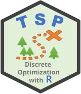

# Parallelize 'TSP' functions

+ = 

The **futurize** package allows you to easily turn sequential code into
parallel code by piping the sequential code to the
[`futurize()`](https://futurize.futureverse.org/reference/futurize.md)
function. Easy!

## TL;DR

``` r

library(futurize)
plan(multisession)
library(TSP)

data("USCA50")
tour <- solve_TSP(USCA50, method = "nn", rep = 10L) |> futurize()
```

## Introduction

The **[TSP](https://cran.r-project.org/package=TSP)** package provides
algorithms for solving the traveling salesperson problem (TSP).

### Example:

Example adopted from
[`help("solve_TSP", package = "TSP")`](https://rdrr.io/pkg/TSP/man/solve_TSP.html):

``` r

library(futurize)
plan(multisession)
library(TSP)

data("USCA50")
methods <- c(
  "identity", "random", "nearest_insertion", "cheapest_insertion",
  "farthest_insertion", "arbitrary_insertion", "nn", "repetitive_nn", 
  "two_opt", "sa"
)

## calculate tours - each tour in parallel
tours <- lapply(methods, FUN = function(m) {
  solve_TSP(USCA50, rep = 10L, method = m) |> futurize()
})
names(tours) <- methods
```

This will parallelize the computations, given that we have set up
parallel workers, e.g.

``` r

plan(multisession)
```

The built-in `multisession` backend parallelizes on your local computer
and works on all operating systems. There are [other parallel
backends](https://www.futureverse.org/backends.html) to choose from,
including alternatives to parallelize locally as well as distributed
across remote machines, e.g.

``` r

plan(future.mirai::mirai_multisession)
```

and

``` r

plan(future.batchtools::batchtools_slurm)
```

## Supported Functions

The following **TSP** functions are supported by
[`futurize()`](https://futurize.futureverse.org/reference/futurize.md):

- [`solve_TSP()`](https://rdrr.io/pkg/TSP/man/solve_TSP.html)

## Without futurize: Manual PSOCK cluster setup

For comparison, here is what it takes to parallelize
[`solve_TSP()`](https://rdrr.io/pkg/TSP/man/solve_TSP.html) using the
**parallel** and **doParallel** packages directly, without **futurize**:

``` r

library(TSP)
library(parallel)
library(doParallel)

data("USCA50")

## Set up a PSOCK cluster and register it with foreach
ncpus <- 4L
cl <- makeCluster(ncpus)
registerDoParallel(cl)

## Solve the TSP in parallel via foreach
tour <- solve_TSP(USCA50, method = "nn", rep = 10L)

## Tear down the cluster
stopCluster(cl)
registerDoSEQ()  ## reset foreach to sequential
```

This requires you to manually create a cluster, register it with
**doParallel**, and remember to tear it down and reset the **foreach**
backend when done. If you forget to call
[`stopCluster()`](https://rdrr.io/r/parallel/makeCluster.html), or if
your code errors out before reaching it, you leak background R
processes. You also have to decide upfront how many CPUs to use and what
cluster type to use. Switching to another parallel backend, e.g. a Slurm
cluster, would require a completely different setup. With **futurize**,
all of this is handled for you - just pipe to
[`futurize()`](https://futurize.futureverse.org/reference/futurize.md)
and control the backend with
[`plan()`](https://future.futureverse.org/reference/plan.html).
