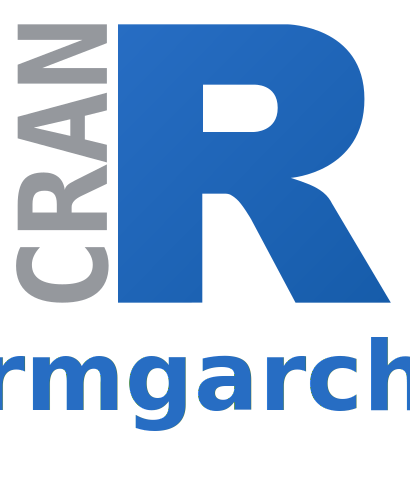

<!--
%\VignetteIndexEntry{Parallelize 'rmgarch' functions}
%\VignetteAuthor{Henrik Bengtsson}
%\VignetteKeyword{R}
%\VignetteKeyword{package}
%\VignetteKeyword{rmgarch}
%\VignetteKeyword{vignette}
%\VignetteKeyword{futurize}
%\VignetteEngine{futurize::selfonly}
-->

<div class="logos">

<span>+</span>

<span>=</span>

</div>

The **futurize** package allows you to easily turn sequential code
into parallel code by piping the sequential code to the `futurize()`
function. Easy!


# TL;DR

```r
library(futurize)
plan(multisession)
library(rmgarch)

fit <- dccfit(spec, data = returns) |> futurize()
```


# Introduction

This vignette demonstrates how to use this approach to parallelize
**[rmgarch]** functions such as `dccfit()`, `dccforecast()`, and
`gogarchfit()`.

The **[rmgarch]** package provides multivariate GARCH models
including Dynamic Conditional Correlation (DCC), Copula-GARCH, and
GO-GARCH models. These models involve fitting multiple univariate
GARCH models as a first step, which can be parallelized across
series. The package accepts a `cluster` argument for parallel
evaluation via the **parallel** package.

By piping to `futurize()`, you can leverage any future-based parallel
backend for these computations.


## Example: Fitting a DCC-GARCH model

The `dccfit()` function fits a Dynamic Conditional Correlation
multivariate GARCH model. Fitting the univariate GARCH models for
each series can be parallelized:

```r
library(rmgarch)
library(rugarch)

set.seed(42)
n <- 300L
dat <- matrix(rnorm(n * 2L), ncol = 2L)
colnames(dat) <- c("x1", "x2")

## Create univariate GARCH(1,1) specs
uspec <- ugarchspec(
  mean.model = list(armaOrder = c(0, 0)),
  variance.model = list(garchOrder = c(1, 1))
)
mspec <- multispec(replicate(2, uspec))

## DCC(1,1) specification
spec <- dccspec(uspec = mspec, dccOrder = c(1, 1),
                distribution = "mvnorm")

## Sequential fit
fit <- dccfit(spec, data = dat)
```

Here `dccfit()` fits each univariate model sequentially. To run in
parallel, pipe to `futurize()`:

```r
library(futurize)

fit <- dccfit(spec, data = dat) |> futurize()
```

This will distribute the univariate GARCH fits across the available
parallel workers, given that we have set up parallel workers, e.g.

```r
plan(multisession)
```

The built-in `multisession` backend parallelizes on your local
computer and works on all operating systems. There are [other
parallel backends] to choose from, including alternatives to
parallelize locally as well as distributed across remote machines,
e.g.

```r
plan(future.mirai::mirai_multisession)
```

and

```r
plan(future.batchtools::batchtools_slurm)
```


# Supported Functions

The following **rmgarch** functions are supported by `futurize()`:

* `betacokurt()`
* `betacoskew()`
* `cgarchfilter()`
* `cgarchfit()`
* `cgarchsim()`
* `convolution()`
* `dccfilter()`
* `dccfit()`
* `dccforecast()`
* `dccroll()`
* `dccsim()`
* `DCCtest()`
* `fmoments()`
* `fscenario()`
* `gogarchfilter()`
* `gogarchfit()`
* `gogarchforecast()`
* `gogarchroll()`
* `gogarchsim()`


[rmgarch]: https://cran.r-project.org/package=rmgarch
[other parallel backends]: https://www.futureverse.org/backends.html
